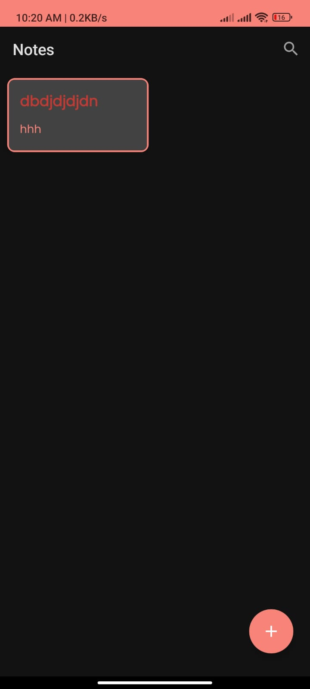
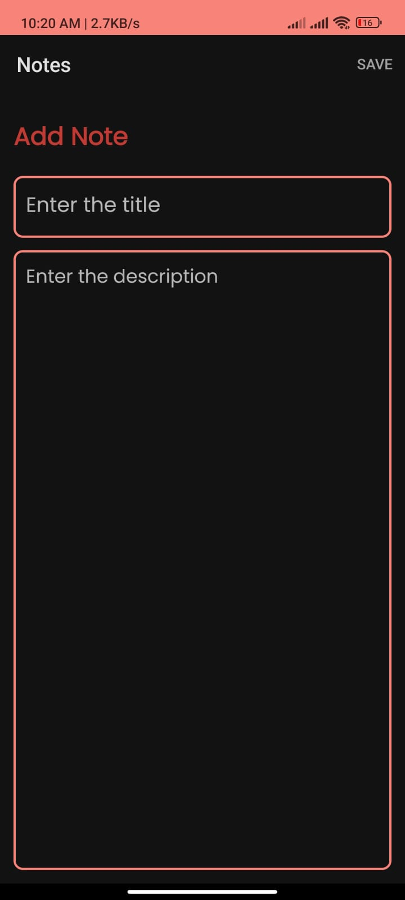
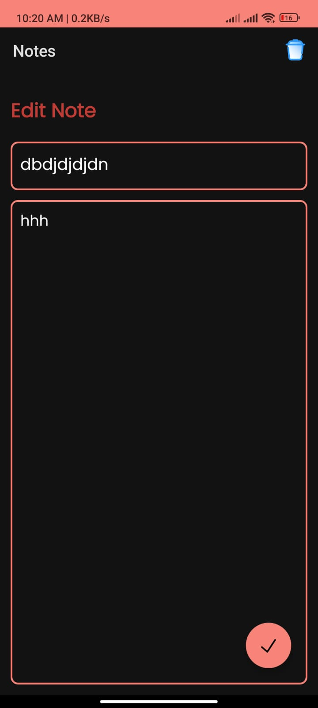

# Notes App

A simple and efficient notes application built with **Kotlin**. This app allows users to create, edit, delete, and organize their notes easily.

## Features

- **Create Notes**: Add new notes with titles and descriptions.
- **Edit Notes**: Update the content of existing notes.
- **Delete Notes**: Remove unwanted notes with ease.
- **Search**: Quickly find notes by title or keywords.
- **Categorization**: Organize notes into categories.
- **Offline Support**: Access your notes without an internet connection.

## Screenshots

| Home Screen | Create Note Screen | Search Screen |
|-------------|---------------------|---------------|
|  |  |  |

## Technologies Used

- **Kotlin**: Programming language for Android development.
- **Room Database**: Local database for storing notes.
- **MVVM Architecture**: Ensures a clean and maintainable codebase.
- **LiveData**: Observes data changes.
- **ViewModel**: Manages UI-related data lifecycle-aware.

## Installation

1. Clone the repository:

   ```bash
   git clone https://github.com/yourusername/notes-app.git
   cd notes-app
   ```

2. Open the project in Android Studio.

3. Build the project and run it on an emulator or a physical device.

## How to Use

1. Launch the app on your device.
2. Add a new note by clicking the "+" button.
3. Edit or delete notes by selecting them from the list.
4. Use the search bar to find specific notes.

## Upcoming Features

- **Note Sharing**: Share notes with others.
- **Reminder Functionality**: Set reminders for important notes.
- **Cloud Sync**: Sync notes across multiple devices.
- **Rich Text Formatting**: Add styles and formatting to your notes.

## Contributing

Contributions are welcome! Please follow these steps:

1. Fork the repository.
2. Create a new branch for your feature or bug fix.
3. Commit your changes and push them to your fork.
4. Submit a pull request explaining your changes.

---

### Acknowledgments

- Kotlin community for their excellent resources and documentation.
- Android Jetpack for providing powerful tools like Room, LiveData, and ViewModel.
